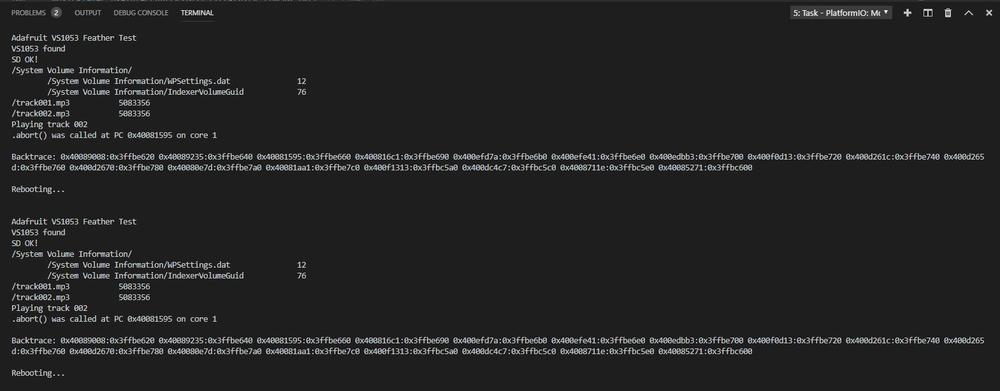
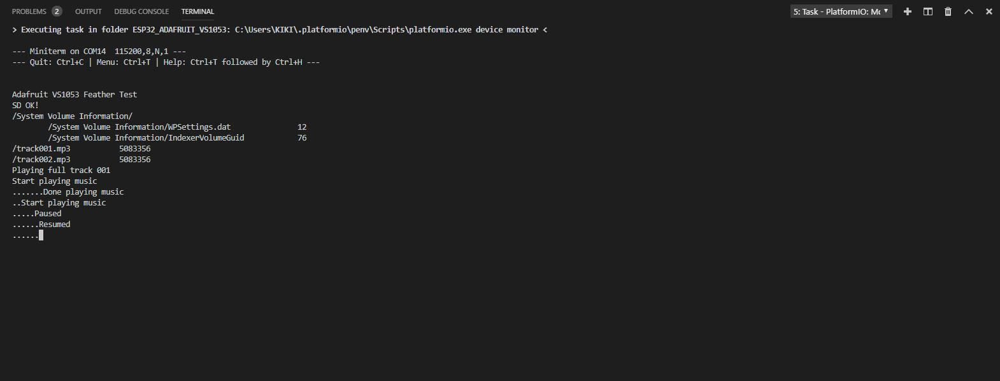

# ESP32_ADAFRUIT_VS1053
Modified Adafruit VS1053 Library for ESP32 to prevent exception.

When I downloaded Adafruit VS1053 Library, It didn't work properly for ESP32.<br>
https://github.com/adafruit/Adafruit_VS1053_Library<br>
<br>
I read some articles in the issue forum and found that interrupt handling causes the exception like below.<br>
<br>

I fixed Adafruit_VS1053 source and header files. 
I moved buffer feeding codes from ISR to main loop.
In the ISR, I just set the flag and leave like below.

```
static void feeder(void) {  
  /* eziya76, set flag and leave ISR */
  //myself->feedBuffer();
  myself->DREQFlag = true;
}

void loop() {
    
  /* eziya76, when IRQ fires, handler set DREQFlag */
  if(musicPlayer.DREQFlag) {
    /* feed buffer when DREQ interrupt */
    musicPlayer.feedBuffer();
    musicPlayer.DREQFlag = false;
  }

  // File is playing in the background
  static boolean printed = false;
  if (musicPlayer.stopped()) {
    if(!printed) {
      Serial.println("Done playing music");    
      printed = true;
    }    
  }
  
  /* eziya76, remove delay to handle DREQ interrupt ASAP */
}

```

I also added some code for LCSoft module. 
I learned it from here (https://www.stm32duino.com/viewtopic.php?t=3989)<br>

```
/* eziya76, LCSoft VS1053 patch. Refer to https://www.stm32duino.com/viewtopic.php?t=3989 */
  musicPlayer.sciWrite(VS1053_REG_WRAMADDR, VS1053_GPIO_DDR);
  musicPlayer.sciWrite(VS1053_REG_WRAM, 3);
  musicPlayer.sciWrite(VS1053_REG_WRAMADDR, VS1053_GPIO_ODATA);
  musicPlayer.sciWrite(VS1053_REG_WRAM, 0);
  delay(100);
  musicPlayer.softReset();

  /* eziya76, remove sineTest as it clears LCSoft VS1053 patch */
  //musicPlayer.sineTest(0x44, 500);    // Make a tone to indicate VS1053 is working
```

When I modified and added like above, I was able to listen my MP3 songs.
<br>
<br>
[](https://youtu.be/WfA05_ioqfI)

